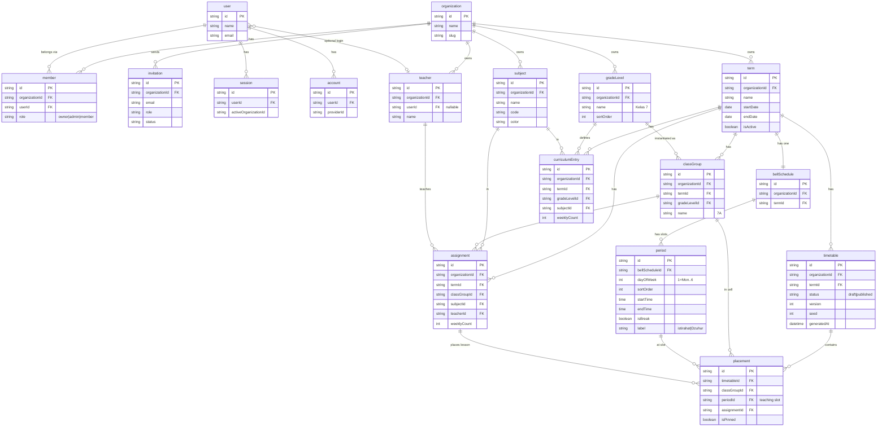

# atur-kelas — Automated Timetabling: Design & Shared Understanding

Status: design agreed (2026-06-20). Phase 0 (foundation) ✅. Phase 1 setup ✅ — terms,
grades, subjects, teachers, bell schedule (window+breaks model), classes, per-grade
curriculum + feasibility counter, per-class assignments. Generator 14a ✅ — solver
(matching-based, benchmark-validated), feasibility pre-check, generate, per-class grid,
regenerate/try-again/publish, stale-input banner. Generator 14b ✅ — click-to-swap
editing (hard-block clash, soft-warn), pin/lock cells, pin-preserving regenerate.
**Phase 1 complete.** (Fixed: a server-only helper in `timetable.ts` leaked `db`→
`postgres`→`Buffer` into the client bundle, crashing hydration app-wide — which had
manifested as the "Select isn't selectable" report. Server-only helpers now live in
`timetable-data.ts`, imported only inside handlers. Verified in-browser via Playwright.)
A dev seed (`make seed` / `make fresh`) provides a ready-to-use school. **Phase 2 ✅** —
public per-class share links (`/p/<token>`, no auth, SSR), backed by a denormalized
`publishedSnapshot` written on publish (point-in-time, immune to later edits); admin
`/share` page lists copyable links. **Phase 3 ✅** — export: a print-optimized `/print`
view (all classes, page-breaks → browser Save-as-PDF), Print buttons on the timetable
and public pages (`print:hidden` chrome), and a CSV download (long-format, opens in
Excel). Phase 4 pending.

## 1. The problem

Schools re-build their weekly lesson timetable (_jadwal pelajaran_) by hand every
semester. We automate the generation of a clash-free weekly timetable and give the
admin a draft they can tweak, then publish.

This is the classic **class–teacher timetabling problem** (K-12 variant). Because
teachers are shared across classes, it is a genuine constraint-satisfaction problem,
**not** a simple grid-fill — but with only the two hard constraints below it stays
tractable (its hard core is a bipartite edge-coloring; König's theorem guarantees a
clash-free solution exists iff no teacher's total load exceeds the number of weekly
slots).

## 2. Model of the world

- **K-12**: students stay in one room (a _kelas_ / class group); teachers rotate to them.
- **Multiple classes, shared teachers**: one teacher teaches a subject to several classes.
- **Teacher→subject→class assignment is INPUT.** The admin states the facts ("Pak Budi
  teaches Math to 7A 5×/wk, 7B 5×/wk"). The system only _places_ those lessons in time.
- **Curriculum is defined per grade level**, inherited by every class in that grade.
  Teacher assignment is per class.

## 3. Constraints

### Hard (must hold; solver enforces, edit UI blocks)

1. **No teacher clash** — a teacher is in at most one class per (day, period).
2. **No class gaps** — every teaching period of every class must be filled (students
   stay in the room, so a hole = unsupervised kids). The class grid is fully packed.

### Soft (optimize; edit UI warns but allows)

1. **Balance teacher daily load** — avoid giving a teacher 8 straight periods; spread evenly.
2. **Spread a subject across distinct days** — prefer Math on Mon/Wed/Fri over 3× Monday.

## 4. The feasibility coupling (central invariant)

Because every class slot must be filled, for each class:

    sum(weeklyCount of its assignments)  ==  number of teaching slots in the week

- If the sum is **less** → unfillable holes. If **more** → physically impossible.
- The setup UI shows a **live slot counter** per class ("Kelas 7A: 38/40 — 2 short")
  and **blocks generation** until every class balances exactly.
- Additionally each teacher's total weekly load must be ≤ total weekly teaching slots,
  else no clash-free schedule exists (warn early).

## 5. Day structure

The teaching day **varies by day of week** (e.g. shorter Friday for Jumat prayer,
Monday ceremony) and has **fixed break slots** (istirahat, Dzuhur). Modeled as a
per-term **bell schedule**: for each weekday, an ordered list of periods, each marked
teaching or break with start/end times.

> **Resolved (load-bearing):** all classes share **one school-wide bell schedule** —
> the same daily pattern applies to every grade. This is what keeps the problem a clean
> bipartite edge-coloring: the teaching slots are a single global, interchangeable set,
> so König guarantees a clash-free solution exists iff no teacher's load exceeds the slot
> count, and feasibility is checkable up front (§4). If this ever changes to differ _by
> grade_, the placement problem becomes list edge-coloring (NP-hard even for bipartite
> graphs), the up-front feasibility guarantee is lost, and §1/§4/§10 must be softened.

## 6. Output & automation model

- **Generate draft → admin tweaks → publish.** The generator never owns the final answer.
- **Pin & regenerate**: admin pins placements they like; re-running the solver keeps
  pinned slots fixed and re-solves the rest.
- **Deterministic**: same inputs → same output (debuggable). A "try again" button
  reshuffles (increments a stored seed) for a different valid layout.
- **Edit UI**: drag-to-move. Hard violations block the drop; soft violations warn.

## 7. Tenancy, auth, roles

- **Multi-tenant SaaS from day one.** Each school = a Better Auth **organization**;
  every domain entity is scoped by `organizationId`. (Add the Better Auth organization
  plugin to the current email/password setup.)
- **Roles / consumers**
  - _Admin / account manager_ — sets up data, generates, edits, publishes. (Core.)
  - _Student / parent_ — **Phase 2**, via unguessable **public per-class link** (no
    student accounts).
  - _Teacher_ — views own schedule **behind a login** (real account). **Phase 4** (after
    export). Teacher is a **data record** that gets linked to a Better Auth account via
    email invite; scheduling is never blocked on teacher onboarding.

## 8. Tech stack

- TanStack Start (React 19) + Nitro — already scaffolded.
- **Postgres + Drizzle** (Better Auth Drizzle adapter). Not yet wired.
- shadcn / Tailwind v4 / Base UI — already present.
- Solver runs **server-side** as a TanStack Start server function.

## 9. Data model (sketch, all tenant-scoped by `organizationId`)

- Better Auth: `organization`, `user`, `member`, `invitation`, `session`, `account`.
- `term` — semester: name, start/end, isActive.
- `gradeLevel` — e.g. "Kelas 7", with order.
- `classGroup` (rombel) — belongs to term + gradeLevel; e.g. "7A".
- `subject` (mapel) — name, short code, color.
- `teacher` — name; nullable `userId` link to an account.
- `bellSchedule` — per term; per weekday an ordered list of `period`
  rows {order, start, end, isBreak, label}. Teaching periods define the weekly slots.
- `curriculumEntry` — (term, gradeLevel, subject, weeklyCount). The grade-level curriculum.
- `assignment` (teaching load) — (term, classGroup, subject, teacher, weeklyCount).
  weeklyCount defaults from the grade's curriculum; teacher chosen per class. The solver
  expands each assignment into `weeklyCount` lesson instances to place.
- `timetable` — (term, status: draft|published, version, generatedAt, seed).
- `placement` — (timetable, classGroup, dayOfWeek, periodIndex, assignment, isPinned).
  One placement fills one (class, teaching-slot) cell.

## 9.1 Schema diagram

Every domain table carries `organizationId` (tenant scope). Better Auth tables on the
left handle identity + tenancy; domain tables on the right handle scheduling.

**The three flows to read off this diagram:**

1. **Setup** — `organization` → `term` → (`gradeLevel`, `subject`, `teacher`,
   `bellSchedule`). `bellSchedule` → `period` rows define the weekly time slots.
2. **Demand** — `curriculumEntry` says "Grade 7 needs Math 5×/wk"; `assignment`
   binds that to a real `classGroup` + `teacher` ("Pak Budi, Math, 7A, 5×"). The
   feasibility invariant: per class, Σ `assignment.weeklyCount` == count of teaching
   `period`s.
3. **Result** — the solver expands each `assignment` into `weeklyCount` lessons and
   writes `placement` rows: one (`classGroup`, teaching `period`) cell ← one
   `assignment`. `placement` is the generated timetable.

## 10. Algorithm

- Variables = lesson instances (assignments expanded by weeklyCount). Domain = the
  class's teaching slots. Per class the assignment is a bijection onto its slots
  (fully packed).
- **Hard**: backtracking search with MRV (most-constrained variable) + forward
  checking / propagation on teacher per-slot availability. Pinned placements are fixed.
- **Soft**: after a feasible solution, a bounded local-search pass (swap moves,
  hill-climb / light simulated annealing) minimizes a cost = teacher daily-imbalance +
  same-subject-same-day clustering.
- **Determinism**: tie-breaks seeded from the timetable's stored seed.
- Medium scale (~15–40 classes). Hand-rolled in TypeScript — no heavyweight solver lib.

> **Extensibility note:** structure the solver around a single
> `isPlacementLegal(lesson, slot, state)` predicate rather than two hard-coded checks.
> Teacher availability ("Pak Budi can't teach Mondays") and shared rooms/labs are the
> two most common real-world additions; both are out of scope now (user confirmed none),
> but both break the König guarantee and can make a term infeasible. A general predicate
> means adding one later is a new clause, not a solver rewrite.

## 11. Term reuse

A new term can **clone the previous term** (grade levels, subjects, bell schedule,
curriculum, teacher assignments). The admin only adjusts what changed — directly
attacking the "every semester I redo everything" pain.

## 12. Phasing

- **Phase 0 — Foundation** ✅ _(done)_: Postgres+Drizzle (Docker Compose for local dev),
  Better Auth + organization plugin, sign-up/sign-in, server-side session guard,
  organization onboarding (auto owner membership), dashboard shell. Schema generated via
  `@better-auth/cli`; versioned migrations in `drizzle/`.
- **Phase 1 — Admin generator** (the value): terms, grade levels, subjects, classes,
  teacher records, bell schedule editor, per-grade curriculum, per-class assignments,
  live feasibility counter, clone-term; server-side solver (hard constraints), per-class
  grid view, drag-edit (hard-block/soft-warn), pin + regenerate, deterministic +
  try-again, soft objectives; **publish** (draft → published).
- **Phase 2 — Public links**: unguessable per-class share links to the published
  timetable for students/parents; read-only public pages, no accounts.
- **Phase 3 — Export**: print / PDF export (then Excel).
- **Phase 4 — Teacher view** (authenticated): teacher account invites, link teacher
  records to accounts, per-teacher schedule view behind login.

## 13. Decisions log (what was settled)

| #   | Decision                                                                                                   |
| --- | ---------------------------------------------------------------------------------------------------------- |
| 1   | K-12, multiple classes, shared teachers; students stay, teachers rotate                                    |
| 2   | Teacher→subject→class assignment is admin **input**, not solver output                                     |
| 3   | Curriculum per **grade level**, inherited by classes; teacher per class                                    |
| 4   | Hard constraints: no teacher clash; every class period filled                                              |
| 5   | Soft objectives: balance teacher load; spread subject across days                                          |
| 6   | Mismatch handling: block generation + live slot counter                                                    |
| 7   | Day structure varies by day + fixed breaks (per-term bell schedule)                                        |
| 8   | Multi-tenant SaaS day one; school = Better Auth organization                                               |
| 9   | Phasing order: admin generator → public links (students) → export → teacher view (authenticated, accounts) |
| 10  | Postgres + Drizzle                                                                                         |
| 11  | Medium scale; hand-rolled backtracking + local search, server-side                                         |
| 12  | Pin slots + regenerate the rest                                                                            |
| 13  | Clone previous term as new-term starting point                                                             |
| 14  | Teacher = data record, optional account via invite                                                         |
| 15  | One deterministic result + "try again" reshuffle                                                           |
| 16  | One school-wide bell schedule for all grades (keeps problem tractable)                                     |

## 14. Generator plan (Phase 1, task #14)

Setup (#8–#13) is done; everything the solver needs exists: teaching slots (derived
from the bell schedule), classes, and per-class `assignment` rows
(class, subject, teacher, weeklyCount). This section plans the generator.

### 14.1 Problem restated in terms of the data we have

- **Slots**: `T` = total weekly teaching slots, derived from the bell schedule
  (`computeDaySlots` per day). Each slot is identified by `(dayOfWeek, slotIndex)`.
  One global grid — every class shares it (decision #16).
- **Lessons**: for each class, expand its assignments by `weeklyCount` into lesson
  instances, each carrying `(subject, teacher)`. Per class, the count of instances
  must equal `T` (feasibility invariant).
- **Hard constraints**: H1 — a teacher is in ≤1 class per slot (no clash). H2 — every
  class slot is filled (each class places exactly one lesson per slot). A class having
  one lesson per slot is automatic (we assign its `T` lessons bijectively to its `T`
  slots).
- **Soft objectives**: S1 — balance each teacher's load across days (avoid piling a
  teacher onto one day / long runs). S2 — spread a subject's weekly occurrences across
  distinct days (no 3× Math on Monday).

This is the **class–teacher timetabling** problem; its hard core is **bipartite
edge-coloring** (classes × teachers, edges = lessons, colors = slots). By König, a
clash-free timetable **exists** iff every class has exactly `T` lessons and every
teacher's load ≤ `T` — both checkable up front.

### 14.2 Feasibility pre-check (block generation until clean)

Before solving, validate and report all blockers with links to fix:

1. Bell schedule has ≥1 teaching slot.
2. Each class: Σ assigned `weeklyCount` == `T`, AND every curriculum subject has a
   teacher (no unassigned). (Surfaces as "Kelas 7A: 38/40, IPA unassigned".)
3. Each teacher: total weekly load ≤ `T` (else no clash-free schedule exists).
   - Corollary (worth its own message): Σloads = #classes·`T` ≤ #teachers·`T`, so this
     check also catches **#teachers < #classes** → auto-infeasible.

### 14.3 Algorithm (decided: guaranteed construction, then optimize)

The hard core is bipartite edge-coloring, which is **poly-time guaranteed**. Backtracking
is rejected as the default: the realistic "most teachers booked at load == `T`" instance
is exactly where greedy/MRV paints into a corner and restarts thrash → "Generate hangs",
which is fatal for the product's core feature.

1. **Construct (hard-feasible, can't hang)** — matching-based edge-coloring. Build the
   class×teacher multigraph (a parallel edge per lesson instance). Regularize to
   `T`-regular bipartite: add `#teachers − #classes` dummy "free-period" class-vertices
   (≥0 by the corollary above) plus dummy edges so every teacher reaches degree `T`.
   Extract `T` perfect matchings (one per slot) via Kuhn's augmenting-path matching
   (~40 lines, reused `T` times). Each matching → that slot's (class → lesson)
   assignment. No backtracking, no dead-ends.
2. **Optimize (soft)** — hill-climb with **within-class swap** moves: swap the slots of
   two lessons in the same class (keeps H2 automatically; only re-check H1 on the two
   affected slots) when it lowers the soft penalty. Bounded iterations.
   - Penalty = w1·(same-subject-same-day count) + w2·(teacher daily-load imbalance).

- **Validate the choice with a benchmark first** (see 14.6): a tight synthetic instance
  (~20 classes, `T`≈40, teachers packed at load == `T`). Matching-based must solve it
  fast; this also tells us if backtracking would have been safe (it's the fallback only
  if the benchmark blesses it).
- **Pins**: pinned placements are fixed inputs; the solver only fills/optimizes the rest.
- **Determinism**: seeded PRNG (mulberry32); the seed is stored on the timetable.
  "Try again" re-runs with a new seed.

### 14.4 Data model additions

- `timetable` (one per term): `id, organizationId, termId (unique), status
(draft|published), seed, generatedAt, publishedAt`, plus an **inputs stamp**
  (`inputsHash` or at least `slotCount` at generation time) for stale detection.
- `placement`: `id, timetableId, classGroupId, dayOfWeek, slotIndex, assignmentId,
isPinned`. Unique `(timetableId, classGroupId, dayOfWeek, slotIndex)`. Slots are
  derived (no period table); `assignmentId` yields subject+teacher.
- **Stale detection**: placements reference derived `(dayOfWeek, slotIndex)` and
  `assignmentId`; editing the bell schedule or assignments after generating silently
  invalidates them. Stamp the timetable with what it was generated against and show
  "inputs changed — regenerate" on the grid instead of rendering a stale timetable.

### 14.5 UI flow & staging

- **14a** (first): timetable/placement schema + migration; feasibility pre-check screen
  (block + reasons); solver server fn → draft placements; **per-class grid view** (days
  × slots, colored by subject); **regenerate** + **try again** (new seed); **publish**
  (draft→published). Grid is read-only here.
- **14b** (next): in-grid **editing** (move/swap a lesson, hard-block illegal drops,
  soft-warn) + **pin/lock** cells that regenerate preserves.

(Per-teacher grid view stays Phase 4 with teacher logins; the admin gets per-class +
the existing teacher-load table for sanity checks.)

Publish was flip-status-in-place in Phase 1; **resolved in Phase 2: snapshot-on-publish.**
Publishing serializes the grid into `timetable.publishedSnapshot` (jsonb, denormalized);
the public page reads the snapshot. It's a point-in-time artifact — immune to later
assignment/curriculum/rename edits, and stays live/stable while the admin edits a fresh
draft (re-publish overwrites it). Chosen because admins do touch published timetables
mid-semester (substitutions, staffing).

### 14.6 Resolved decisions / build order

- **Solver: matching-based construction is primary** (guaranteed, can't hang). Backtracking
  is a fallback only if the tight-instance benchmark blesses it.
- **Build order for 14a**: (1) feasibility pre-check + the benchmark harness → run the
  tight instance to confirm the solver before building on it; (2) timetable/placement
  schema + migration; (3) solver server fn → draft; (4) per-class grid view; (5)
  regenerate / try-again / publish; (6) stale-input banner. Schema, pre-check, grid, and
  publish can proceed in parallel with the solver.
- **Edit mechanism (14b)**: click-two-cells-to-swap (exposes the local-search move
  directly) — not decided now, deferred to 14b.
